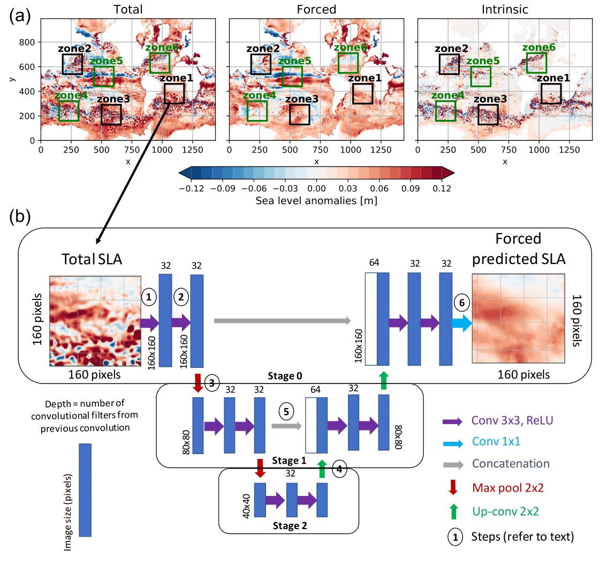
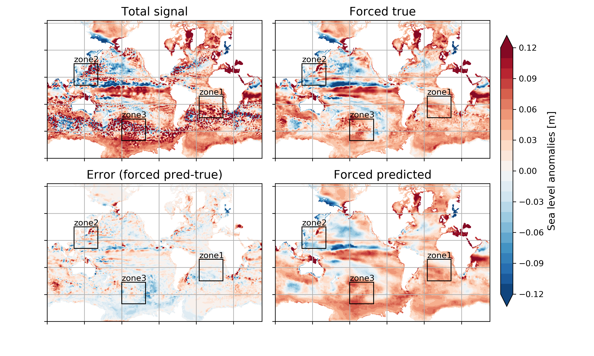
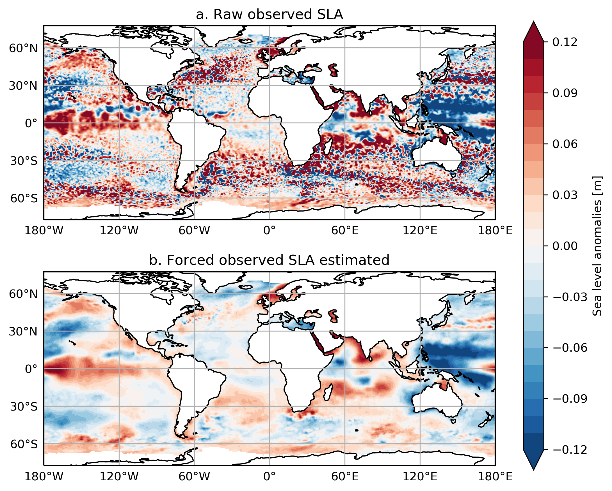

# A Machine Learning Technique to Attenuate the Imprint of Chaotic Ocean Variability in Altimetric Observations

Mickaël Lalande, Redouane Lguensat, Sally Close and Thierry Penduff

[IGE - Institut des Géosciences de l'Environnement](http://www.ige-grenoble.fr/) 
<mickael.lalande@univ-grenoble-alpes.fr>

 
This repository aims to make available the code for the submission of the paper "A Machine Learning Technique to Attenuate the Imprint of Chaotic Ocean Variability in Altimetric Observations". An example of the use of the U-Net algorithm on the model grid is presented in the notebook estimate_forced_component.ipynb. Also, an application to observation data is presented in the notebook apply_unet_to_obs.ipynb. Only one snapshot is presented in this repository, for example. For more detail on the data set and the study, please refer to the paper that will be linked here as soon as a first online version will be available.

The environment used for this repository is detailed in the file spec-file.txt. To use the spec file to create an identical environment on the same machine or another machine (with Anaconda: https://docs.conda.io/projects/conda/en/latest/user-guide/tasks/manage-environments.html):

    > conda create --name myenv --file spec-file.txt

# U-Net architecture 

(a) Snapshot (January 3, 1979; member 50) of SLA contributions (x and y correspond to model grid indices). The black boxes show the training zones and the green boxes show testing zones (160x160 pixels). (b) The U-Net architecture used in this study: inputs are total SLA 5-daily model fields and outputs their forced counterparts (in zone 1 for this example). Each blue box corresponds to a feature map (volume corresponding to the image size times the number of stacked images). White boxes represent copied feature maps. The arrows denote the different operations.

# Example of application on the model

Illustration on January 3, 1979 of the performance of the U-Net algorithm trained on zone 1+2+3. Top left: total signal (member 1); top right: true forced signal (ensemble mean); bottom right: predicted forced signal; bottom left: difference between the predicted and true forced signals.

# Application on observations

(a) Raw observational SLA product on January 3, 1993. (b) Forced observed SLA estimated from the latter field with the U-Net algorithm. Data were interpolated on the model grid before prediction and interpolated back onto the observational grid.
